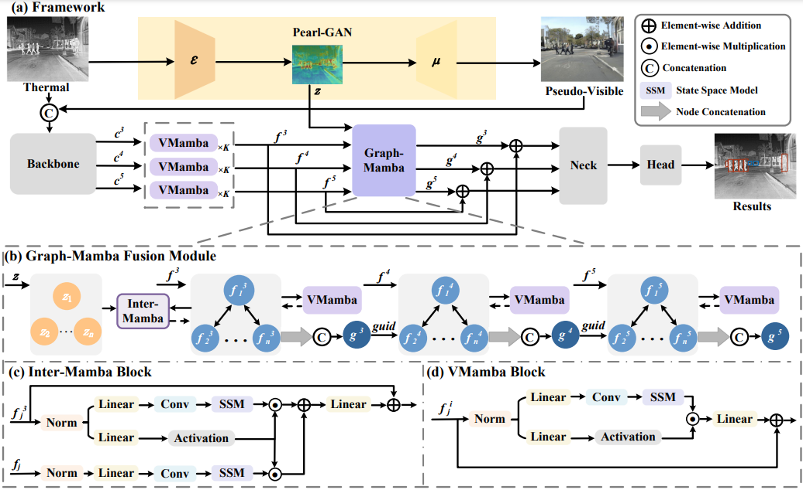

# Pseudo Visible Feature Fine-Grained Fusion for Thermal Object Detection (CVPR-25)

## Environmental Requirements
We utilize YOLOX, implemented via the [MMDetection](https://github.com/open-mmlab/mmdetection) for environment setup instructions.

Our development environment includes the following dependencies:
```
python==3.9
torch==1.12.1+cu116
torchvision==0.13.1+cu116
mmcv-full==1.7.2
mmdet==2.26.0
```

Additionally, install the official Mamba library by following the instructions in the [hustvl/Vim](https://github.com/hustvl/Vim) repository. After installation, replace the `mamba_simpy.py` file in the installation directory with the version available in the `mamba` block directory of the [Pan-Mamba](https://github.com/alexhe101/Pan-Mamba) repository.

## About the Code
This repository contains only the modifications made to the MMDetection codebase. For example:
- Add the code in `mmdetection/mmdet/datasets/FLIR.py` to your MMDetection.
- Ensure all newly added classes are registered in `__init__.py`.

## Dataset and Models
* Datasets and model checkpoints can be downloaded from this [cloud link](https://pan.baidu.com/s/17ortStRXXm__ypKNx8uJaw), with the extraction code: `PFGF`.
* Download the Pearl-GAN pretrained weights from https://github.com/FuyaLuo/PearlGAN/. Place them into configs/graphmamba/pearlgan_ckpt/FLIR_NTIR2DC/.

## Inference
To evaluate the FLIR dataset, run the following command:
```
python tools/test.py configs/graphmamba/yolox_l_tirgraphmamba_1x8_200e_FLIR_r.py work_dirs/flir.pth --eval mAP
```

## Training
To train the model on the FLIR dataset, use the command:
```
python tools/train.py configs/graphmamba/yolox_l_tirgraphmamba_1x8_200e_FLIR_r.py
```
## Acknowledgement
This project is based on [mmdetection](https://github.com/open-mmlab/mmdetection), [DATFF](https://github.com/a21401624/DATFF/tree/master), [Pan-Mamba](https://github.com/alexhe101/Pan-Mamba/tree/main), [Cas-Gnn](https://github.com/LA30/Cas-Gnn). Thanks for their wonderful works.

## Citation
If you find our PFGF framework useful, please consider citing our paper:
```
@inproceedings{li2025pseudo,
  title={Pseudo Visible Feature Fine-Grained Fusion for Thermal Object Detection},
  author={Li, Ting and Ye, Mao and Wu, Tianwen and Li, Nianxin and Li, Shuaifeng and Tang, Song and Ji, Luping},
  booktitle={Proceedings of the Computer Vision and Pattern Recognition Conference},
  pages={6710--6719},
  year={2025}
}
